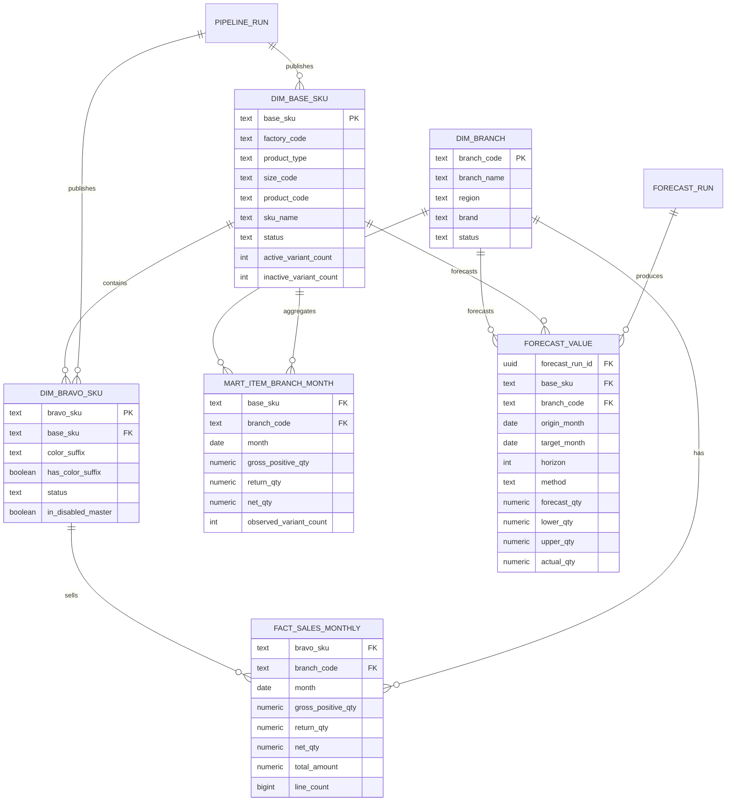

# Thiết kế database Supabase

## 1. Nguyên tắc

- Không xóa, truncate hoặc update dữ liệu nguồn.
- Không thay đổi khóa của bảng nguồn.
- Tạo schema `analytics` cho dữ liệu chuẩn hóa và kết quả.
- Khóa business là text để giữ số 0 đầu.
- Tất cả bảng dẫn xuất có `pipeline_run_id`, `created_at` hoặc `refreshed_at`.
- Migrations được review trước khi chạy trên Supabase.

## 2. Bảng nguồn hiện biết

Tên thực tế phải được xác nhận lại trên Supabase trước khi code. Từ tài liệu/ảnh hiện có:

### Sales monthly

| Trường | Kiểu logic | Ghi chú |
|---|---|---|
| `bravo_sku` | text | khóa sản phẩm nguồn |
| `sku_name` | text | tên theo nguồn sales |
| `branch_code` | text | giữ số 0 đầu |
| `unit` | text | phạm vi dùng M2 |
| `month` | date | ngày đầu tháng |
| `total_quantity` | numeric | có thể âm |
| `total_amount` | numeric | có thể âm |
| `line_count` | integer | số dòng giao dịch gốc |

Khóa kỳ vọng: `(bravo_sku, branch_code, month)`.

### Master SKU vô hiệu hóa

Các cột tối thiểu cần map:

| Cột nguồn | Trường chuẩn |
|---|---|
| `Mã SKU` | `base_sku` |
| `Bravo SKU` | `bravo_sku` |
| `Tên SKU` | `sku_name` |
| `Trạng thái` | `source_status` |
| `Mã mới` | `replacement_sku` |
| `Ngày tạo` | `source_created_at` |
| `Ngày cập nhật` | `source_updated_at` |

### Master channel

| Cột nguồn | Trường chuẩn |
|---|---|
| `Mã chi nhánh` | `branch_code` |
| `Tên chi nhánh` | `branch_name` |
| `Vùng` | `region` |
| `Thương hiệu` | `brand` |
| `Trạng thái` | `source_status` |
| `Ngày tạo` | `source_created_at` |
| `Ngày cập nhật` | `source_updated_at` |

## 3. Mô hình quan hệ đề xuất



## 4. Các bảng dẫn xuất

### `analytics.pipeline_run`

| Trường | Kiểu | Ý nghĩa |
|---|---|---|
| `id` | uuid PK | mã run |
| `run_type` | text | `refresh`, `forecast` |
| `status` | text | `running`, `failed`, `published` |
| `source_max_month` | date | tháng sales lớn nhất |
| `started_at`, `finished_at` | timestamptz | thời gian chạy |
| `row_counts` | jsonb | số dòng đầu vào/đầu ra |
| `error_message` | text | lỗi nếu có |

### `analytics.dim_base_sku`

Một dòng/SKU gốc. Status được tính từ toàn bộ variant đã biết. Index: `(status)`, `(product_type, size_code)`, trigram/search index cho `base_sku` và `sku_name` nếu cần.

### `analytics.dim_bravo_sku`

Một dòng/Bravo SKU. Có FK tới `dim_base_sku`; lưu Group 5, cờ master vô hiệu hóa, first/last observed month và trạng thái.

### `analytics.dim_branch`

Một dòng/chi nhánh sau chuẩn hóa. Chỉ API mặc định lấy branch active nhưng vẫn giữ dòng inactive để truy vết lịch sử.

### `analytics.fact_sales_monthly`

Bản chuẩn hóa của sales nguồn ở grain Bravo SKU × branch × month. Không biến missing thành zero.

Khóa: `(bravo_sku, branch_code, month)`.

### `analytics.mart_item_branch_month`

Aggregate chính cho biểu đồ và forecast, grain base SKU × branch × month.

Khóa: `(base_sku, branch_code, month)`.

### `analytics.mart_item_summary`

Phục vụ danh sách Module 1, gồm status, số variant, first/last sale và quantity 3/6/12 tháng. Có thể materialize để tránh aggregate lại cho mỗi request.

### `analytics.data_quality_issue`

Lưu ngoại lệ có thể truy vết. Không xóa dòng lỗi khỏi nguồn.

### `analytics.forecast_run`, `analytics.forecast_value`, `analytics.backtest_metric`

Lưu phiên bản dự báo, từng giá trị forecast và metric theo SKU/branch/horizon/method.

## 5. View/API surface

Nếu backend kết nối PostgreSQL trực tiếp, không cần expose bảng analytics qua Data API. Nếu sử dụng Supabase Data API:

- Chỉ expose schema `api` với các view tối thiểu.
- View trên PostgreSQL 15+ dùng `security_invoker = true` nếu phải tuân theo RLS của bảng nền.
- Áp dụng cả `GRANT` và RLS; RLS không thay thế object grants.
- Không cấp quyền `INSERT/UPDATE/DELETE` cho frontend trong sản phẩm chỉ đọc.

Tham khảo: [Securing your API](https://supabase.com/docs/guides/api/securing-your-api) và [Row Level Security](https://supabase.com/docs/guides/database/postgres/row-level-security).

## 6. Quyền database đề xuất

```text
app_source_reader:
  SELECT trên đúng các bảng nguồn cần thiết

app_analytics_writer:
  SELECT/INSERT/UPDATE/DELETE trên schema analytics
  không có DROP/TRUNCATE bảng nguồn

app_api_reader:
  SELECT trên view phục vụ API
```

Trong MVP có thể dùng một backend role có tổng quyền tương đương hai role đầu, nhưng không dùng tài khoản chủ sở hữu database làm runtime credential.

## 7. Refresh an toàn

- Build dữ liệu vào `pipeline_run_id` mới hoặc bảng staging.
- Chạy validation.
- Chỉ cập nhật con trỏ `published_run_id` khi PASS.
- Nếu FAIL, API tiếp tục đọc run published trước đó.
- Không dùng `TRUNCATE ... CASCADE` hoặc overwrite bảng nguồn.
